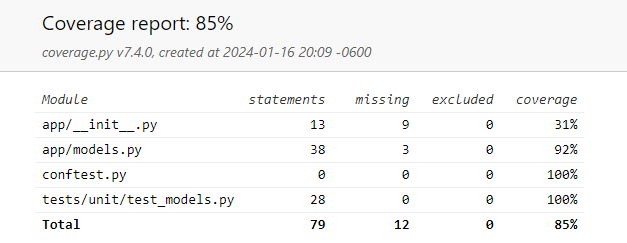

<p align="center">
  
</p>

# Fruit API

Welcome to the Fruit Inventory Management System (FIMS)!

This system is used to keep track of the most perishable and hardest to keep track of items in any grocery store: fruits (and vegetables, if you please so).

## Features

Here are the core features:

* You can request **POST** to create an entry for a fruit
* You can request **GET** to get the list of all the inventory
* You can request **PUT** to update a single piece of inventory based on id
* You can request **DELETE** to delete a piece of inventory based on id

You can run some analysis on the information:

* Getting total quantity, most common fruit in the inventory, and average quantity for each fruit (you will need to expose this function through the APIß)

Finally, you can run a search on any of the fruit parameters with a **GET** request:

* Name, "Apple"
* Variety, "Honeycrisp"
* Season, "Fall"
* Minimum quantity, 10
* Maximum quantity, 100

## How to Contribute

### Running Locally

Start by creating a virtual environment and installing dependencies:

```bash
$ python3 -m venv venv
$ source venv/bin/activate
$ pip3 install -r requirements.txt
```

Then install the dependencies and run the application:

```bash
(venv) $ python3 run.py
 * Serving Flask app 'app'
 * Debug mode: on
WARNING: This is a development server. Do not use it in a production deployment. Use a production WSGI server instead.
 * Running on http://127.0.0.1:5000
Press CTRL+C to quit
 * Restarting with stat
 * Debugger is active!
 * Debugger PIN: 161-411-520
127.0.0.1 - - [14/Jan/2024 18:45:30] "DELETE /api/fruits/2 HTTP/1.1" 200 -
127.0.0.1 - - [14/Jan/2024 18:45:34] "GET /api/fruits HTTP/1.1" 200 -
127.0.0.1 - - [14/Jan/2024 18:46:30] "PUT /api/fruits/4 HTTP/1.1" 200 -
127.0.0.1 - - [14/Jan/2024 18:46:35] "GET /api/fruits HTTP/1.1" 200 -
```

And start making requests with tools like :

```bash
# POST request to add inventory
$ curl --location 'http://127.0.0.1:5000/api/fruits' --header 'Content-Type: application/json' --data '{ 
     "name": "Apple",
     "quantity": 15,
     "variety": "Honeycrisp",
     "season": "Fall"
}'
{
  "id": 8,
  "message": "Fruit added successfully"
}
# GET request to see inventory
$ curl --location 'http://127.0.0.1:5000/api/fruits'
[
  {
    "id": 1,
    "name": "Banana",
    "quantity": 10,
    "season": "Summer",
    "variety": "Big Mike"
  },
  {
    "id": 3,
    "name": "Apple",
    "quantity": 15,
    "season": "Fall",
    "variety": "Honeycrisp"
  },
...
]
# GET request to search inventory based on name and min quantity
$ curl --location 'http://127.0.0.1:5000/api/fruits/search?name=Apple&min_quantity=15'
[{
    "id": 3,
    "name": "Apple",
    "quantity": 15,
    "season": "Fall",
    "variety": "Honeycrisp"
  }
]
```

Feel free to use a REST API client to have a GUI app that lets you make those requests, such as , , or .

### Running with Docker

If you are having trouble running this code in your local, perhaps due to some misconfiguration, you can turn to the power of .

You must have Docker installed: https://www.docker.com/

```bash
$ docker build -t flask-fruit-api .
[+] Building 11.1s (9/9) FINISHED 
$ docker run -p 5000:5000 flask-fruit-api     
```

This will build the image based on the current version of your code and run the API in your localhost.

It is generally advised to re-build the Docker image whenever you make code changes, so you will need to repeat the step above every time you make changes and want to see the result.

### Testing

If you would like to test the code, run the `pytest` through the `coverage` tool.

 is a Python testing framework while  is a tool for measuring code coverage.

Together, they will test the code **and** tell you what lines the tests have covered.

```bash
(venv) $ coverage run -m pytest
========== test session starts ==========
platform linux -- Python 3.10.13, pytest-7.4.4, pluggy-1.3.0
rootdir: /starter
collected 8 items                                                                                                                                                               

tests/unit/test_models.py ........                                                                                                                                        [100%]

========== 8 passed in 0.27s ==========
$ coverage report -m
Name                        Stmts   Miss  Cover   Missing
---------------------------------------------------------
app/__init__.py                13      9    31%   6-18
app/models.py                  38      3    92%   28, 44, 50
conftest.py                     0      0   100%
tests/unit/test_models.py      28      0   100%
---------------------------------------------------------
TOTAL                          79     12    85%
```

You may also generate an HTML version of the code coverage report:

```bash
(venv) $ coverage html
Wrote HTML report to htmlcov/index.html
```



## Some features to add

Unit testing:
* Add a Datetime attribute so that you can record when your produce will expire

API testing:
* Add an Endpoint that will return expired produce based on the previously suggested features
* Endpoint for analytics